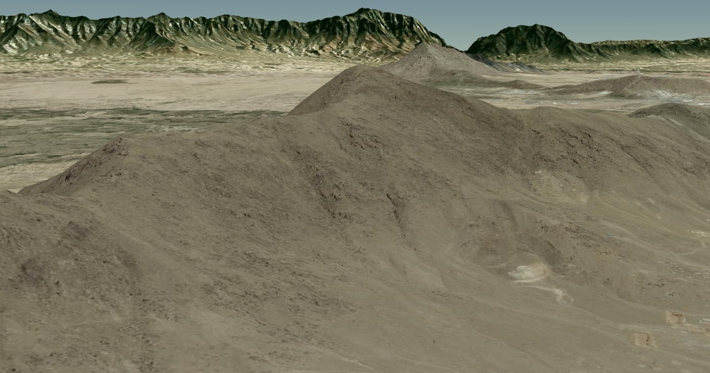

WCSTerrainProvider
==================

This is a Terrain Provider for Cesium 
Elevation si request from a WCS 2.0.1 endpoint. 
This provider has been tested with a Geoserver
Response of the WCS is a geotiff which is parsed with  GeotiffParser.js
in order to obtain the heightmap.

In the withIndexedDB directory there is a version of the WCSTerrainProvider.js
which use IndexedDB (TileCacheService.js) to store heightmap.

-----------------------------------------------------------
WCSTerrainProvider in action  :



-----------------------------------------------------------
How to use it  :

First you need to provide the Elevation throught a WCS Service. 
I use Geoserver for doing that. 
For my example I have installed a Geoserver under a Tomcat on my computer. 
I can access the WCS by this URL : http://localhost:8080/geoserver/wcs

For Cesium, I nneded to initialize the terrainProvider as follow : 

```javascript
var WCSTerrainProvider = new Cesium.WCSTerrainProvider({
service: "WCS",
url: "http://localhost:8080/geoserver/wcs",
layerName: "layerName",
bbox: [longitude - 0.1, latitude - 0.1, longitude + 0.1, latitude + 0.1],
waterMask: false
});

cesiumContainer.scene.terrainProvider = WCSTerrainProvider;
```
